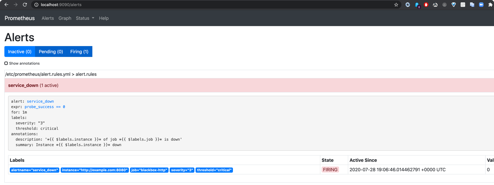
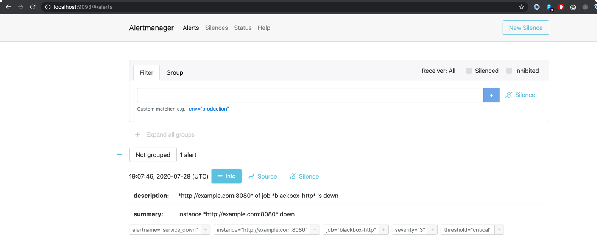
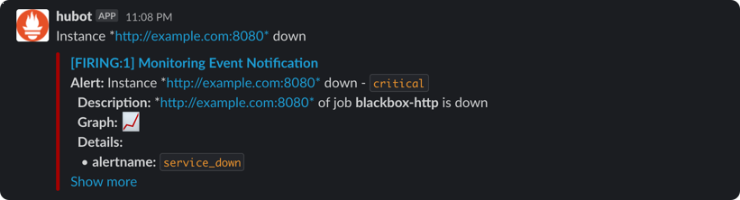

## Testing Prometheus alertmanager for the sending alerts to slack

[Docs Referred](https://grafana.com/blog/2020/02/25/step-by-step-guide-to-setting-up-prometheus-alertmanager-with-slack-pagerduty-and-gmail/)

- Start the services using
```bash
$ docker-compose up -d
Creating network "11-prom-blackboxexporter-alertmanager_host" with the default driver
Creating prometheus-sandbox ... done
Creating blackboxexporter   ... done
Creating alertmanager-sandbox ... done
```

- Check the [http://localhost:9090/targets](http://localhost:9090/targets) are up


- Check the [http://localhost:9090/alerts](http://localhost:9090/alerts)




- Wait for 1 min and check if the Alerts move to Pending state. After this wait for 1 mins and check if the
alert moves to Firing state.


- You can also access the [http://localhost:9093/#/alerts](http://localhost:9093/#/alerts) and check the 
alerts (after they moved to firing state)



- Now you should receive a slack notification as shown below



